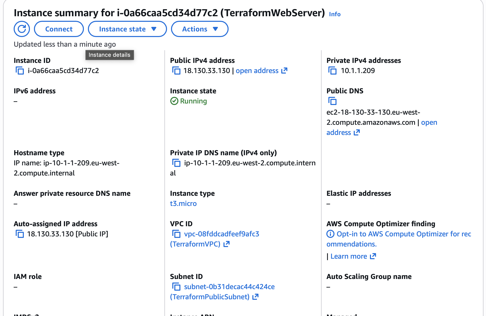
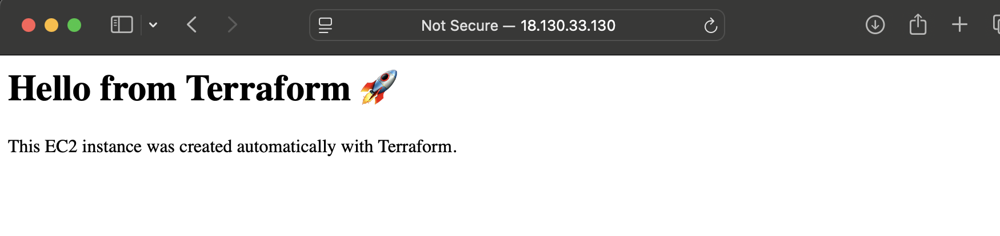

# Terraform AWS Infrastructure Project

## Overview
This project demonstrates how to provision AWS infrastructure using Terraform.

I used Infrastructure as Code to automate the deployment of a basic AWS environment, including networking, security, and compute resources.

## Infrastructure Created
- VPC
- Public Subnet
- Internet Gateway
- Route Table
- Route Table Association
- Security Group
- EC2 Instance
- Apache web server installed automatically with user data

## Tools Used
- Terraform
- AWS
- EC2
- VPC
- Linux
- GitHub

## Terraform Workflow
- `terraform init`
- `terraform validate`
- `terraform plan`
- `terraform apply`
- `terraform destroy`

## 📸 Screenshots

### ✅ Terraform Apply

### 🌐 Live Website

## What I Learned
- How to automate AWS infrastructure using Terraform
- How Terraform providers, resources, variables, and outputs work
- How networking components in AWS connect together
- How to deploy a web server automatically using user data
- How to troubleshoot infrastructure errors during deployment

## Challenges I Faced
### Free Tier instance type error
I initially used an EC2 instance type that was not eligible for Free Tier in my AWS account setup.

**Fix:**  
I changed the instance type to one that worked with my account and reran the deployment successfully.

### GitHub authentication issue
I first tried pushing my Terraform project to GitHub using HTTPS and ran into authentication and permission errors.

**Fix:**  
I switched the repository remote to SSH, added my SSH key to GitHub, authenticated successfully, and pushed the project.

## Outcome
The Terraform configuration successfully provisioned AWS resources and launched a working web server automatically.

## Future Improvements
- Add a private subnet
- Add a second EC2 instance
- Use Terraform modules for cleaner structure
- Add CI/CD for automated deployment
